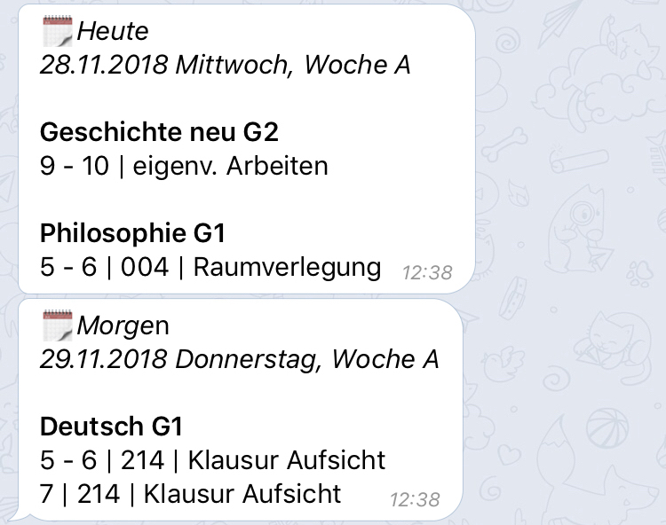

# Vertretungsplan

## Einleitung
Viele Programmierprojekte sind aus Frust entstanden, so auch dieses Projekt.
Sobald sich etwas auf unserem Vertretungplan ändert, wollte ich eine 
Benachrichtigung bekommen. Alle relevanten Informationen, wie zum Beispiel "Fach X 
hat Raumverlegung in Raum Y", sollen in den Benachrichtigungen enthalten sein.

## Einrichtung
Das Einrichten des Bots verlangt kein zusätliches Wissen. Es ist simpel gestaltet.
Der Bot fragt zuerst in welche Stufe der Schüler geht. Anschließend werden die Fächer
abgefragt, die vom Schüler besucht werden. Daraufhin werden die Kurse abgefragt.
Abschließend wird das Setup mit einer Frage nach einem username und dem password
des Vertretungsplans beendet.

## Berichte
Sobald der Vertretungsplan morgens von der Schule hochgeladen wird, werden an alle
registrierten Nutzer des Bots personalisierte Berichte des Vertretungsplans geschickt.

Hier ist ein Beispiel-Bericht:

## Befehle

### /heute, /morgen, /tag
Mit dem Befehl /heute wird der Stundenplan von heute abgerufen. Zusätzlich dazu
wird auch angeben, in welchem Raum unterrichtet wird.

### /kalender
Dieser Befehl holt sich den aktuellen Kalender von der Homepage der Schule und
zeigt die Einträge hier an. Mit den Pfeiltasten kann durch die Wochen gegangen
werden.
### /profile

### /help

## Statistiken

### Nutzerentwicklung

Dieses Tool, ursprünglich für den eigenen Gebrauch, hat sich schnell
in der Schule rumgesprochen. Das führte dazu, dass es gegen Ende meiner Schulzeit
ungefähr 150 Nutzer dieses Projekts gab. Die schnellen Anstiege Mitte September und
Ende November sind jeweils durch eine Nachricht in einen Klassenchat entstanden.

    
    <em>Stand: 07.04.2019</em>

### Klassenverteilung
Die Verteilung der Stufen sieht folgendermaßen aus. In der Q2 sind natürlich die
Benutzer, da ich selbst aus der Q2 bin. Interessant ist, dass es auch vereinzelnt
Nutzer in der Unterstufe gibt. Muss durch Mundpropaganda passiert sein.

    
    <em>Stand: 13.02.2019</em>

